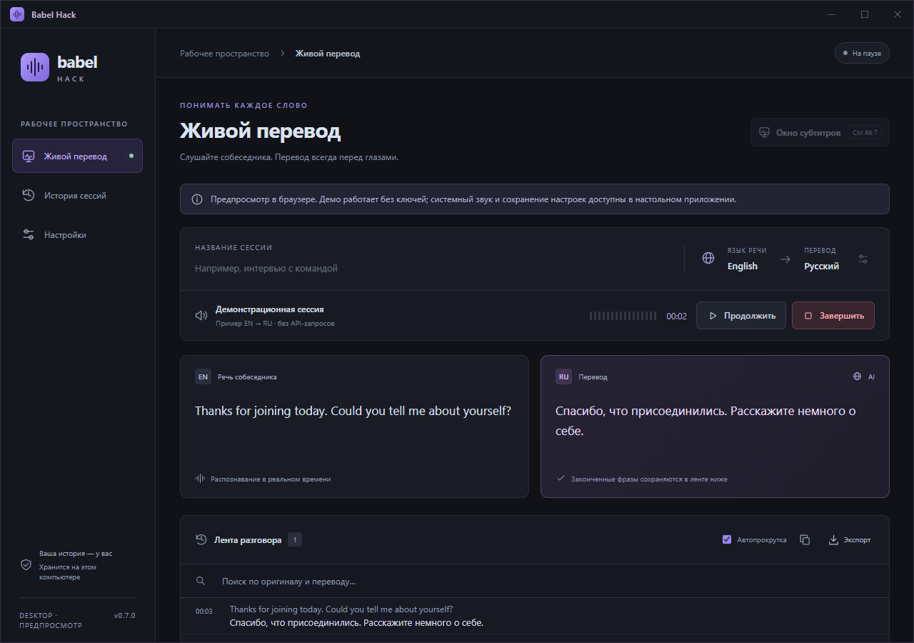

<p align="center"></p>

# Babel Hack

**Живой перевод поверх любого приложения.**

Babel Hack переводит системный звук из звонков, видео и лекций и показывает оригинал и перевод в настраиваемом оверлее. Windows, macOS Intel / Apple Silicon, Linux x64 / ARM64. Tauri 2 · Rust · React.

[Скачать](https://github.com/mr-lexus/babelhack/releases/latest) · [Сборки и проверки](https://github.com/mr-lexus/babelhack/actions/workflows/desktop.yml) · [История изменений](CHANGELOG.md) · [Сообщить о проблеме](https://github.com/mr-lexus/babelhack/issues)



## Возможности

- Захват выбранного аудиовыхода: WASAPI loopback, CoreAudio Process Tap, PulseAudio / PipeWire monitor.
- Потоковое распознавание Deepgram и перевод через OpenAI: растущий черновик и цельные подтверждённые фразы.
- Субтитры поверх окон: размер, перенос, цвета, оригинал, история и отдельные настройки типографики.
- Собственная рамка окна и системный трей с быстрыми действиями; перевод продолжается после скрытия окна.
- Выбор языков, словарь терминов, пауза/продолжение, диагностика и переподключение.
- Локальная история с поиском, копированием и экспортом TXT / Markdown / JSON.
- API-ключи в системном хранилище, автозапуск по желанию, демо без API-запросов.

Интерфейс пока на русском. Речь и перевод поддерживают выбранные в настройках языки.

## Скачать и установить

Все файлы и `SHA256SUMS.txt` находятся в [GitHub Releases](https://github.com/mr-lexus/babelhack/releases).

| Система | Файлы в релизе | Требования |
|---|---|---|
| Windows x64 | `windows-x64-setup.exe`, отдельный `windows-x64.exe` | Windows 10/11, WebView2 Runtime |
| macOS Apple Silicon | `macos-arm64.dmg`, `.app.zip` | macOS 14.6+ |
| macOS Intel | `macos-x64.dmg`, `.app.zip` | macOS 14.6+ |
| Linux x64 | `linux-x64.deb`, `.rpm`, `.AppImage` | Совместимый desktop, WebKitGTK 4.1, PulseAudio / pipewire-pulse |
| Linux ARM64 | `linux-arm64.deb`, `.rpm`, `.AppImage` | Те же зависимости, 64-битная ARM-система |

К именам файлов добавляются `BabelHack-` и номер версии. Linux-пакеты собираются на Ubuntu 22.04. Успешная сборка не означает проверку всех дистрибутивов, драйверов и оконных менеджеров.

**Подпись:** Windows-выпуск без Authenticode; macOS — с ad-hoc подписью, без Apple notarization. ОС может показать предупреждение об неизвестном издателе. Инструкции установки, разрешения и ограничения: [PLATFORMS.md](docs/PLATFORMS.md).

## Первый запуск

1. Установите пакет своей системы; на macOS перенесите приложение из DMG в Applications.
2. Для проверки интерфейса нажмите **Демо** — ключи не нужны, демо EN → RU, история на диск не пишется.
3. В **Настройках** добавьте ключи Deepgram и OpenAI, выберите языки и аудиовыход.
4. Нажмите **Начать перевод**. На macOS разрешите захват системного аудио.
5. Управляйте субтитрами из окна, трея или сочетанием Ctrl+Alt+T (macOS: ⌘⌥T; Wayland — через интерфейс).
6. После разговора нажмите **Завершить**. Полный выход — **Выйти из приложения** в меню трея.

Используются ваши оплачиваемые API-аккаунты. Подписка ChatGPT не заменяет баланс OpenAI API. Звук передаётся в Deepgram, текст, контекст и словарь — в OpenAI. По умолчанию используется `gpt-4.1-mini`; модель можно изменить.

## Данные и совместимость

Для обновления с прежнего Interview Translator сохранены пути и namespace системного хранилища ключей:

- Windows: `%APPDATA%\interview-translator`.
- macOS: `~/Library/Application Support/interview-translator`.
- Linux: `$XDG_CONFIG_HOME/interview-translator` или `~/.config/interview-translator`.

В каталоге находятся `config.json`, `sessions/` и диагностический `app.log`. История не шифруется приложением; JSON на Unix записывается с правами 0600. Аудиофайлы не сохраняются. Ключи хранятся в Credential Manager / Keychain / Secret Service. `BABELHACK_DATA_DIR` задаёт другой абсолютный каталог; прежняя переменная `INTERVIEW_TRANSLATOR_DATA_DIR` также поддерживается. Эти переменные не меняют хранилище ключей.

Babel Hack имеет новый идентификатор приложения. Удалите прежний ярлык и отключите старый автозапуск перед включением нового; не запускайте оба приложения с одним профилем одновременно.

## Разработка

Node.js 22+, Rust stable и [системные зависимости Tauri](https://v2.tauri.app/start/prerequisites/). Платформенные команды — в [PLATFORMS.md](docs/PLATFORMS.md).

```sh
npm ci
npm run tauri dev
npm run build:desktop
```

`npm run dev` запускает браузерное демо на `http://127.0.0.1:1420`. `npm run build:windows` собирает NSIS на Windows. `npm run icons` обновляет все иконки из `public/brand/app-icon.svg`.

```sh
npm run build
npx playwright install chromium webkit
npm test
cargo test --locked --manifest-path src-tauri/Cargo.toml --lib
cargo clippy --locked --manifest-path src-tauri/Cargo.toml --all-targets -- -D warnings
cargo fmt --manifest-path src-tauri/Cargo.toml --check
npm run format:check
```

CI запускает браузерные тесты, Rust-тесты и нативные сборки для пяти целей. На Linux дополнительно проверяются loopback виртуального выхода и Secret Service. Платные live-тесты исключены из обычного запуска. Полезные сценарии: `scripts/smoke-native.mjs`, `scripts/smoke-tray.mjs`, `scripts/audit-rust-dependencies.py`. Нативные Windows smoke-тесты запускаются только в отдельном тестовом профиле через WebView2 CDP, см. [TRAY.md](docs/TRAY.md).

## Ограничения

Сетевой перевод имеет задержку и может ошибаться. Потерянный при разрыве связи звук не восстанавливается. Нет офлайн-распознавания, захвата отдельного приложения, микрофона, диаризации или двустороннего перевода. На macOS оверлей непрозрачный; в Wayland позиционирование и режим поверх окон зависят от compositor. Для ключей на Linux нужен разблокированный Secret Service; для трея может понадобиться AppIndicator-расширение.

## Документация

- [Архитектура](ARCHITECTURE.md), [потоковый перевод](docs/LIVE_TRANSLATION.md), [системный трей](docs/TRAY.md).
- [Платформы](docs/PLATFORMS.md), [выпуск релиза](docs/RELEASING.md), [участие в разработке](CONTRIBUTING.md).
- [Безопасность](SECURITY.md), [аудит](docs/AUDIT.md), [исследование аналогов](docs/COMPETITORS.md).
- `docs/legacy/` — архив прежней реализации, не инструкция к текущему выпуску.

## Лицензия

[Apache License 2.0](LICENSE). Автор: mr-lexus и участники проекта. Лицензии адаптированных сторонних компонентов сохранены в `src-tauri/licenses/` и `src-tauri/vendor/glib/`.
